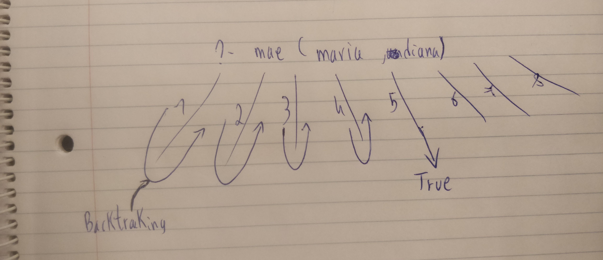
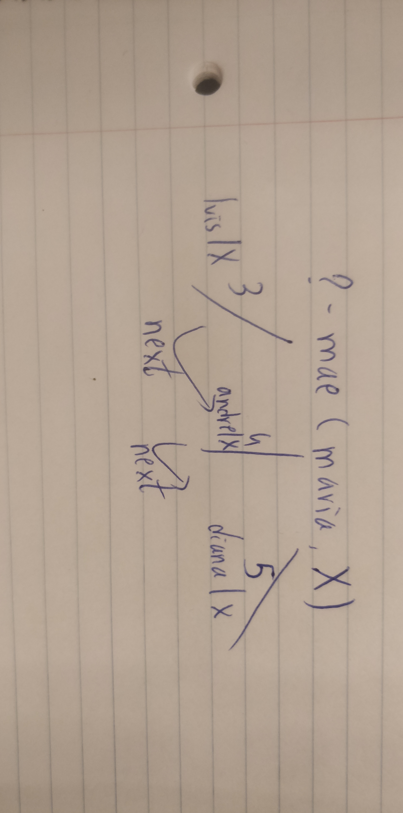

# Aula PL 02/03/2023

``` prolog
    mae(ana,maria).
    mae(ana,manuel).
    mae(maria,luis).
    mae(maria,andre).
    mae(maria,diana).
    mae(diana,paulo).
    mae(teresa,beatriz).
    mae(beatriz,francisco).
```

Primeiro vai fazer um consort, vai pegar primeiro ...

```
    ?-mae(maria,diana)
```

fotos da explicação.

explicar backtracking - dexe na árvore até não ter mais consort's ou nodes para verificar. Com o next forçamos o backtracking.

```
    ?-mae(maria,X)
```



O backtracking fica por defeito num ramo, podendo força-lo a avançar pelo next.

---
## Descendente
Assumimos que as relaçõe ssão da esquerda para a direita.

```
    descendente(X,Y):-mae(Y,X). ->verificar se há descendencia

    :- -> if

    descendente(X,Y):-mae(Y,Z),mae(Z,X). -> verificar descendencia de dois niveis

    descendente(X,Y):-mae(Y,Z),mae(Z,K),mae(K,X). -> verificar descendencia de três niveis
```



Ou podemos usar recursividade;

```
    descendente(X,Y):-mae(Y,Z),descendente(X,Z).
```

Ao usarmos apenas isto, dá erro. Temos de usar o caso de paragem., assim ficando:

```
    descendente(X,Y):-mae(Y,X).
    descendente(X,Y):-mae(Y,Z),descendente(X,Z).
```


### Exemplo:
```
    ?-descendente(maria,ana).
```

Tem 2 consorts, as linhas da linha da recursividade.
X é substituido por Maria e Y por ana.
Podemos usar next, por causa do backtracking e vamos para o segundo consort.
Foto do primeiro consort:

Foto do force, segundo consort: