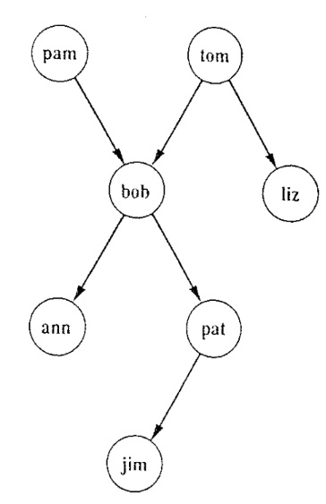

Ir para <a href="#questoes">Questões</a>

Prolog is suited for solving problems that involve objects and relations between objects.

---
How to define a relationship?

parent(bob,tom). -> This is a fact. With more facts this is a particular instance of the parent relation.

parente is the name of the relation.

tom and bob needs to start with a lowercase because they are constants.

---
Podemos começar a fazer mais algumas relações para obter uma árvore e fazer perguntas sobre a mesma no prolog.

``` prolog
    parente(andre,francisco).
    parente(joao,francisco).
    parente(francisco,goncalo).
    parente(goncalo,rui).
```

``` prolog
?-parente(joao,francisco)

Answer: Yes/true
```

``` prolog
?-parente(rui,francisco)

Answer: No/false
```

Podemos ainda fazer perguntas com variaves que são instanciadas com a letra maiscula como por exempllo *X*.

``` prolog
?-parente(X,goncalo)

Answer: X=francisco
```

Nesta solução apenas temos um resposta mas podemos ter casos com várias.

``` prolog
?-parente(X,francisco)

Answer: X=andre
        X=joao
```

``` prolog
?-parente(X,Y)

Answer: X=andre
        Y=francisco

        X=joao
        Y=francisco

        etc
```

---
Cada linha tem de terminar com um ponto final(.), FULL STOP.

Os argumentos das relações podem ser:
<ul>
<li>Objetos concretos, também podemos chamar atomos</li>
<li>Constantes(começadas por minusculas)</li>
<li>Ou objetos gerais ou variaveis</li>
</ul>

# Importante
As perguntas feitas podem ser vistas como objetivos(goals)<br />
Como por exemplo:<br />
```
        parent(X,ann), parent(X,pat)
```
Condiz com a conjugação dos seguintes objetivos:
### X é parende da ann e x é parente da pat
---
<div id="questoes">
        <h1>Questões:</h1>
        <br />
        <h3>1.1.Com a imagem a cima, quais serão as respostas prolog as seguitnes questões:</h3>
``` prolog
        ?- parent(jim,X).
        O jim não começa nenhuma relação apenas acaba
        Resposta: 

        ?- parent(X,jim).
        Resposta: X=pat

        ?- parent(pam,X), parent(X,pat).
        pam é parente de bob e bob é parente de pat
        Resposta: X=bob

        ?- parent(pam,X), parent(X,Y),parent(Y,jim).
        Queremos o parente de pam, X
        E Y parende de jim
        E ainda Y e X parentes
        Resposta: X=bob
                  Y=pat
``
        <h3>1.2.Quais as perguntas a fazer:</h3>

``` prolog
        a) Quem é o parente do Pat?
        ?- parent(X,pat).

        b) A Liz tem algum  filho?
        ?- parent(liz,X).

        c)Quem é o avô do Pat?
        ?- parent(X,pat),parent(Y,X).
```

</div>